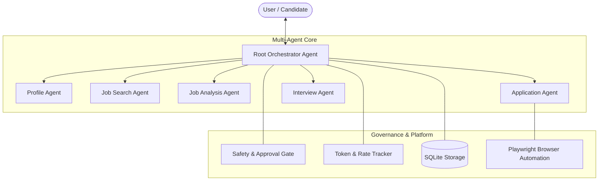

# 🚀 ApplyPilot — Autonomous AI Job Application & Career Copilot

[](https://www.python.org/)
[](https://adk.dev/)
[](https://ai.google.dev/)
[](LICENSE)

**ApplyPilot** is an autonomous, multi-agent career copilot built using the **Google Agent Development Kit (ADK)** and powered by **Google Gemini**. It streamlines the entire job search, ATS matching, application preparation, and interview coaching lifecycle with built-in **human-in-the-loop safety, ethical bounds, and quota governance**.

---

## 📌 Table of Contents
- [Key Features](#-key-features)
- [System Architecture](#-system-architecture)
- [Sub-Agent Hierarchy](#-sub-agent-hierarchy)
- [Safety, Ethics & Governance](#-safety-ethics--governance)
- [Project Structure](#-project-structure)
- [Prerequisites & Installation](#-prerequisites--installation)
- [Quick Start & Usage](#-quick-start--usage)
- [CLI Commands & Developer Tools](#-cli-commands--developer-tools)
- [Configuration](#-configuration)
- [Contributing & License](#-contributing--license)

---

## ✨ Key Features

- **📄 CV Ingestion & Integrity Verification**: Accurately parses resumes while strictly preventing CV tampering, hallucination, or unauthorized modification.
- **🔍 Intelligent Multi-Platform Job Discovery**: Finds, filters, and ranks open roles matching candidate skills, target titles, and compensation preferences without duplicate applications.
- **📊 ATS & Skills Gap Scoring**: Evaluates candidate-job compatibility, pinpoints missing keywords/skills, and screens listings for fraudulent or high-risk postings.
- **📝 Automated Form Filling with Human Review**: Auto-fills complex application web forms via browser automation, staging them in a `READY_FOR_REVIEW` state.
- **🛡️ Strict Human-in-the-Loop Approval**: Guarantees that no application is submitted without explicit confirmation (`approve <app_id>`).
- **🎤 STAR Interview Coaching & Tracking**: Tracks multi-round interview schedules, generates company briefing sheets, and conducts interactive mock interviews with real-time feedback.
- **🛑 Real-time Quota Tracking & Emergency Kill Switch**: Enforces rate limits (RPM, TPM, RPD) and provides an instant halt mechanism (`stop agent` / `Ctrl+Shift+X`).

---

## 🏛️ System Architecture



---

## 🤖 Sub-Agent Hierarchy

| Agent | Responsibility | Key Tools & Actions |
|---|---|---|
| **Root Agent** (`root_agent`) | Central workflow orchestrator, request delegation, policy enforcement, live dashboard. | `show_dashboard`, `stop_agent`, `resume_agent`, `approve_application`, `list_applications` |
| **Profile Agent** (`profile_agent`) | Resume parsing, candidate profile management, career preferences. | `import_cv`, `get_profile`, `update_preferences`, `get_cv_integrity_status` |
| **Job Search Agent** (`job_search_agent`) | Job discovery across sources, search filtering, deduplication. | `search_jobs`, `shortlist_job`, `get_job_details` |
| **Job Analysis Agent** (`job_analysis_agent`) | ATS fit calculation, skills gap breakdown, scam/risk detection. | `analyze_job_fit`, `calculate_ats_score`, `detect_job_risk` |
| **Application Agent** (`application_agent`) | Web form population, drafting, staging review, submission. | `prepare_application`, `fill_form`, `submit_application` |
| **Interview Agent** (`interview_agent`) | Interview tracking, company research briefs, STAR mock interviews. | `track_interview`, `generate_prep_kit`, `start_mock_interview` |

---

## 🛡️ Safety, Ethics & Governance

ApplyPilot strictly enforces the following core safety principles at the policy and runtime layer:
1. **Never Self-Submit**: All applications halt at `READY_FOR_REVIEW`. Submission requires manual human approval.
2. **Zero CV Tampering**: Original qualifications and resume documents are preserved; no unauthorized fabrication.
3. **No CAPTCHA / Auth Circumvention**: Respects platform security boundaries; does not attempt to bypass bot detection.
4. **Credential Isolation**: User passwords and authentication tokens are never exposed or transmitted to LLMs.
5. **Quota Protection**: Proactively enforces RPM, TPM, and RPD ceilings to avoid runaway costs or API exhaustion.

---

## 📁 Project Structure

```
.
├── my-agent/
│   ├── app/
│   │   ├── agents/                  # Multi-agent implementations
│   │   │   ├── root_agent.py        # Orchestrator & dashboard
│   │   │   ├── profile_agent.py     # Profile & CV ingestion
│   │   │   ├── job_search_agent.py  # Job sourcing & discovery
│   │   │   ├── job_analysis_agent.py# ATS scoring & risk analysis
│   │   │   ├── application_agent.py # Application preparation
│   │   │   └── interview_agent.py   # Interview coaching & prep
│   │   ├── browser/                 # Browser automation & kill switch
│   │   ├── parsing/                 # Resume & document parsers
│   │   ├── quota/                   # API rate & token trackers
│   │   ├── safety/                  # Approval gates & policies
│   │   ├── storage/                 # Database schema, repositories & models
│   │   ├── tools/                   # Reusable agent toolsets
│   │   ├── utils/                   # Logging, config & settings
│   │   ├── agent.py                 # Main entrypoint for Google ADK
│   │   └── fast_api_app.py          # FastAPI backend server
│   ├── tests/                       # Unit, integration, and load tests
│   ├── pyproject.toml               # Python dependencies (managed via uv)
│   ├── Dockerfile                   # Container definition
│   └── README.md
├── .gitignore                       # Git ignore configuration
└── README.md                        # Project documentation
```

---

## ⚙️ Prerequisites & Installation

### Prerequisites
- **Python 3.10+**
- [**uv**](https://docs.astral.sh/uv/) (recommended package manager)
- **Google Cloud SDK** (if deploying to Cloud Run / Agent Platform)
- **Gemini API Key** (or Vertex AI credentials)

### Installation

1. **Clone the repository:**
   ```bash
   git clone https://github.com/<your-username>/JOB-AI-AGENT-APPLYPILOT.git
   cd JOB-AI-AGENT-APPLYPILOT/my-agent
   ```

2. **Set up the virtual environment and install dependencies:**
   ```bash
   uv venv
   # On Windows (PowerShell):
   .venv\Scripts\Activate.ps1
   # On macOS/Linux:
   source .venv/bin/activate

   uv sync
   ```

3. **Configure environment variables:**
   ```bash
   cp .env.example .env
   ```
   Add your Gemini API Key and configuration parameters inside `.env`:
   ```env
   GEMINI_API_KEY=your_gemini_api_key_here
   GEMINI_MODEL=gemini-2.0-flash
   MAX_APPLICATIONS_PER_RUN=5
   INTERNAL_MAX_RPM=30
   INTERNAL_MAX_TPM=100000
   INTERNAL_MAX_RPD=1000
   ```

---

## 🚦 Quick Start & Usage

### 1. Launch the Interactive Agent Playground
```bash
agents-cli playground
```
Or with `adk`:
```bash
uv run adk run app.agent:app
```

### 2. Launch the FastAPI Backend
```bash
uv run uvicorn app.fast_api_app:app --host 0.0.0.0 --port 8000 --reload
```

---

## 💬 Example Agent Interaction Flows

### Ingesting Resume & Preferences
> **User:** "Import my resume from data/my_cv.pdf and set my preferences for Remote Senior Python Developer roles in the US."  
> **Agent:** Parses CV, verifies integrity, stores skills, and confirms search preferences.

### Searching & Analyzing Job Openings
> **User:** "Find new job openings matching my profile."  
> **Agent:** Discovers roles, calculates ATS compatibility scores, and presents shortlisted matches.

### Preparing Applications & Human Approval
> **User:** "Prepare an application for the Senior Backend Engineer role at Acme Corp."  
> **Agent:** Auto-fills form inputs, captures screenshot proofs, and marks status as `READY_FOR_REVIEW` (`APP-102`).  
> **User:** "approve APP-102"  
> **Agent:** Executes final submission and confirms submission record.

### Mock Interview Prep
> **User:** "I have an interview scheduled for APP-102 tomorrow. Let's do a mock interview."  
> **Agent:** Generates company briefing sheet and conducts behavioral/technical Q&A using the STAR method.

---

## 🛠️ CLI Commands & Developer Tools

| Command | Purpose |
|---|---|
| `agents-cli playground` | Launch local interactive testing UI with auto-reload |
| `agents-cli lint` | Run linter and code quality checks |
| `agents-cli eval` | Run agent evaluation pipelines against standard test suites |
| `uv run pytest tests/unit tests/integration` | Run automated test suites |
| `agents-cli scaffold enhance` | Generate Terraform infrastructure & CI/CD workflows |
| `agents-cli deploy` | Deploy agent to Google Cloud Run / Agent Platform |

---

## 📄 License

This project is licensed under the **Apache License 2.0**. See the [LICENSE](LICENSE) file for details.
